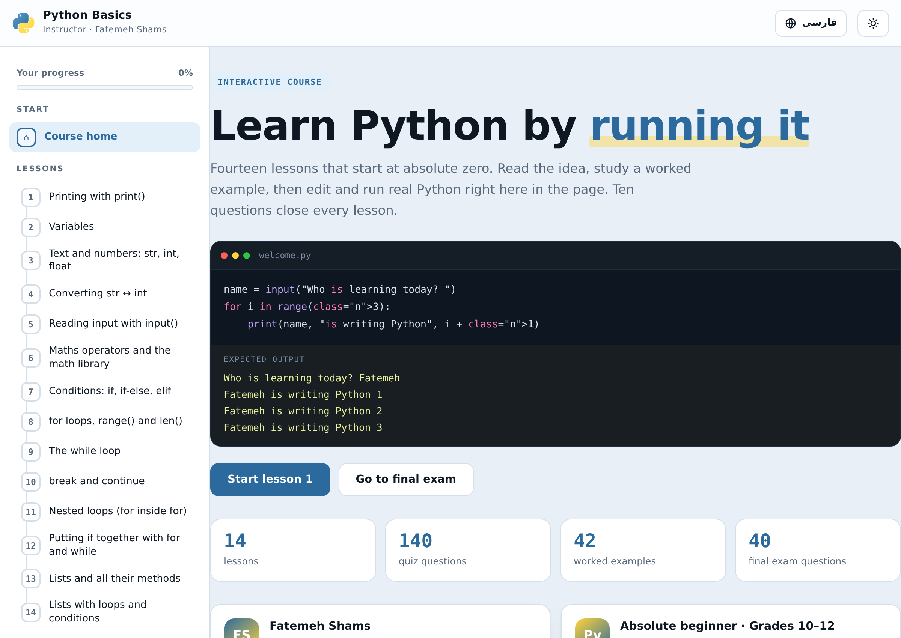
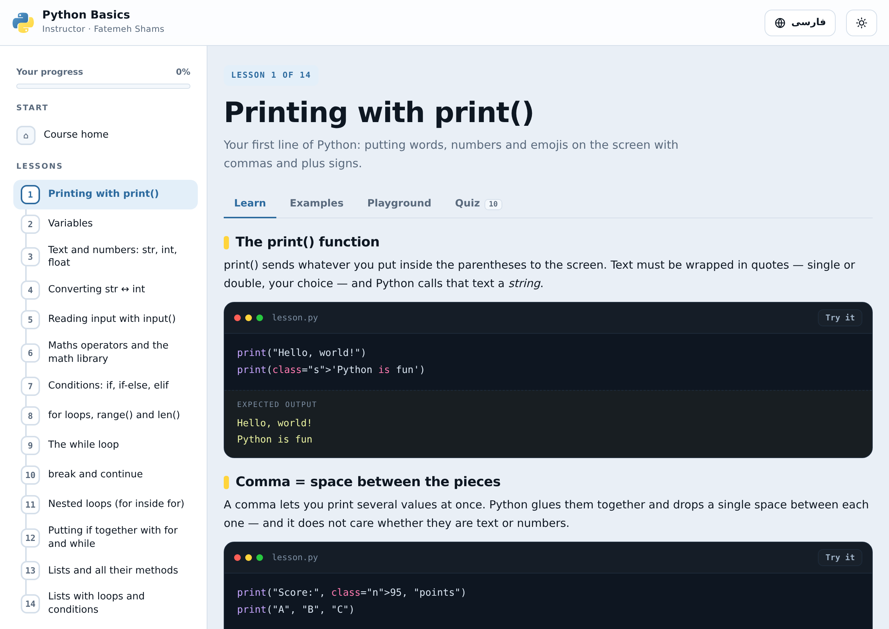
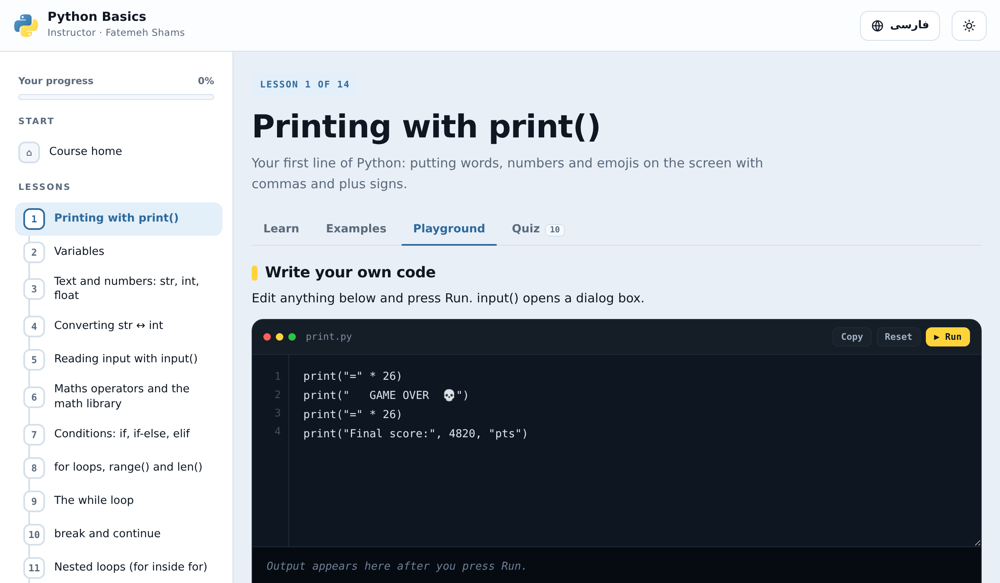
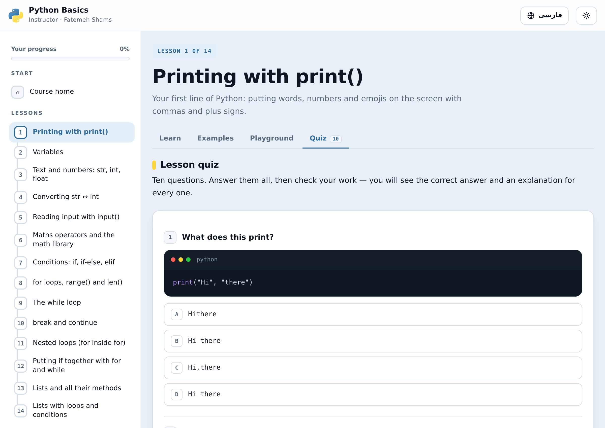
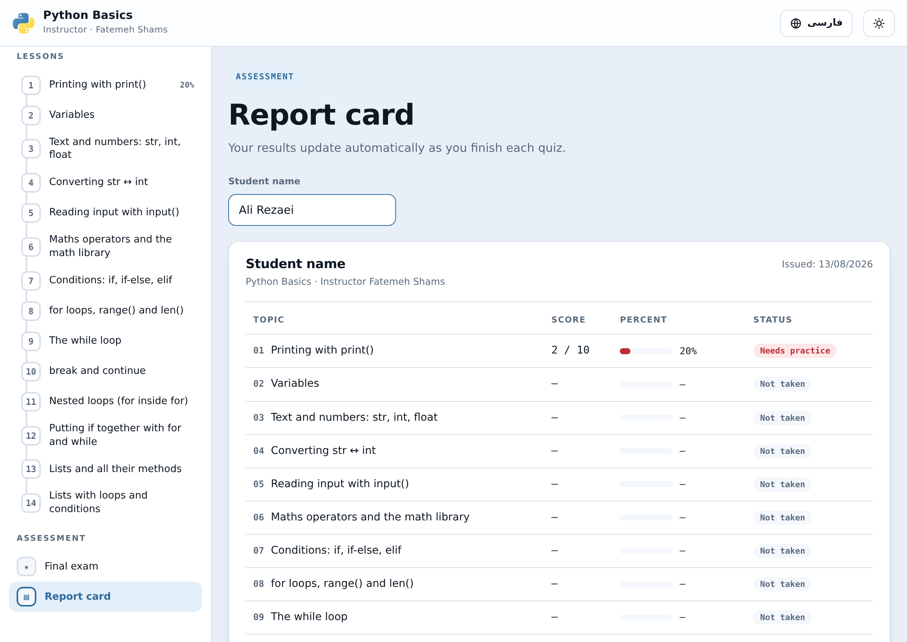
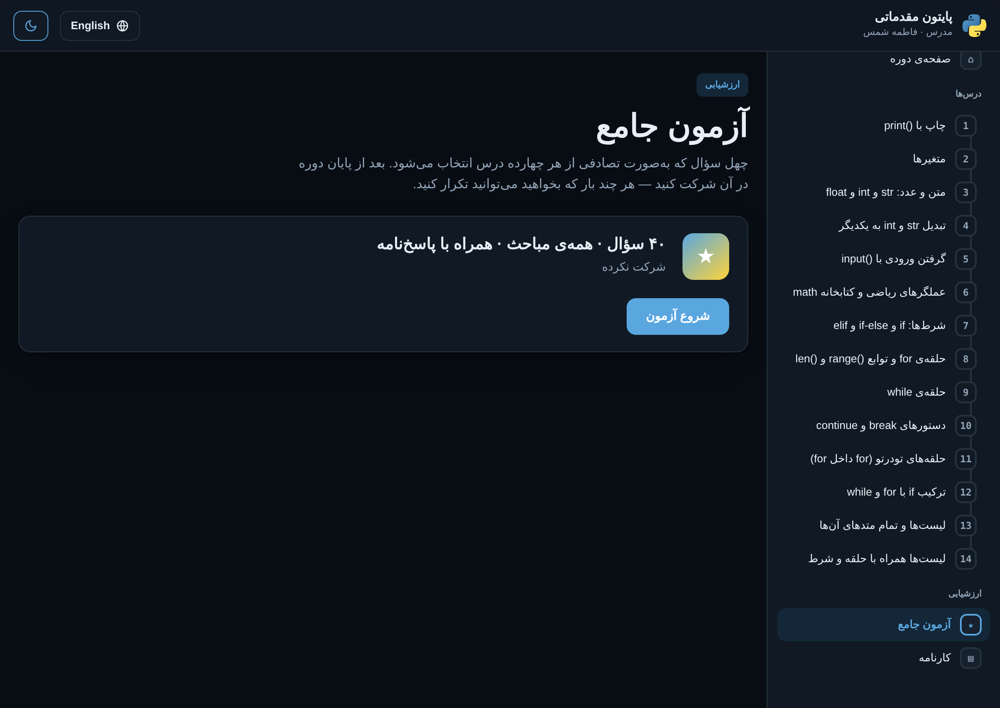

# 🔬 Smart Simulators ShowCase

### Interactive educational simulators that run entirely in your browser
### شبیه‌سازهای تعاملی آموزشی که کاملاً در مرورگر اجرا می‌شوند

<h3>

[**▶️  &nbsp; Open the ShowCase &nbsp; · &nbsp; ورود به ویترین &nbsp; 🚀**](https://fatemeh1203.github.io/Smart-Simulators-ShowCase/)

</h3>

<i>No install, no signup, no download. 
بدون نصب، بدون ثبت‌نام، بدون دانلود.</i>

---

## 🎮 شبیه‌سازها &nbsp;|&nbsp; The Simulators

| | شبیه‌ساز &nbsp;/&nbsp; Simulator | لینک ورود &nbsp;/&nbsp; Entry link |
|:-:|:--|:--|
| 🐍 | **آموزش تعاملی پایتون** — مقدماتی **Interactive Python Course** — beginner | **[/python-lab/](https://fatemeh1203.github.io/Smart-Simulators-ShowCase/python-lab/)** |
| 🎓 | **دورهٔ پایتون مقدماتی** — فاطمه شمس **Python Basics Course** — Fatemeh Shams | **[/python-basics/](https://fatemeh1203.github.io/Smart-Simulators-ShowCase/python-basics/)** |

> **🔬 آزمایشگاه مجازی ریاضی (چهارم دبستان)** روی برنچ جداگانهٔ [`math-lab-grade4`](https://github.com/Fatemeh1203/Smart-Simulators-ShowCase/tree/math-lab-grade4) نگه‌داری می‌شود.
> The **Virtual Math Lab (Grade 4)** now lives on its own [`math-lab-grade4`](https://github.com/Fatemeh1203/Smart-Simulators-ShowCase/tree/math-lab-grade4) branch.

> **فارسی:** ابتدا [صفحهٔ ویترین](https://fatemeh1203.github.io/Smart-Simulators-ShowCase/) را باز کنید، سپس روی دکمهٔ شبیه‌ساز دلخواه کلیک کنید.
> یا با لینک‌های جدول بالا مستقیم وارد همان شبیه‌ساز شوید.
>
> **English:** Open the [showcase page](https://fatemeh1203.github.io/Smart-Simulators-ShowCase/) and press the button for the simulator you want,
> or use the links in the table above to jump straight in.

---

# 🐍 آموزش تعاملی پایتون &nbsp;|&nbsp; Interactive Python

### 👉 [https://fatemeh1203.github.io/Smart-Simulators-ShowCase/python-lab/](https://fatemeh1203.github.io/Smart-Simulators-ShowCase/python-lab/)

**فارسی:** یک دورهٔ کامل پایتون مقدماتی در ۱۴ مبحث. هر مبحث آموزش، مثال‌های اجراشدنی و آزمون ۱۰ سؤالی دارد.
کد پایتون **واقعاً** در مرورگر اجرا می‌شود — نه شبیه‌سازی متنی، بلکه مفسر واقعی پایتون روی WebAssembly (Pyodide).

**English:** A complete beginner Python course in 14 topics. Every topic has a lesson, runnable examples and a ten-question quiz.
The Python code **really runs** in your browser — a genuine CPython interpreter on WebAssembly (Pyodide), not a text simulation.

<table>
<tr>
<td width="50%">
 
<b>Lesson — key points, syntax, worked notes</b> 
آموزش — نکات کلیدی، سینتکس و توضیح
</td>
<td width="50%">
 
<b>Editable code, real output, answer checking</b> 
کد قابل ویرایش، خروجی واقعی و بررسی پاسخ
</td>
</tr>
<tr>
<td width="50%">
 
<b>Ten-question quiz per topic</b> 
آزمون ۱۰ سؤالی برای هر مبحث
</td>
<td width="50%">
 
<b>Progress dashboard with saved results</b> 
کارنامه با نتایج ذخیره‌شده
</td>
</tr>
</table>

### 📚 مباحث &nbsp;|&nbsp; Topics

| # | English | فارسی |
|:-:|:--|:--|
| ۱ | `print` and output | تابع print و چاپ خروجی |
| ۲ | Variables | متغیرها (Variable) |
| ۳ | Strings | رشته‌ها (str) |
| ۴ | Integers | اعداد صحیح (int) |
| ۵ | Type conversion | تبدیل نوع (Type Conversion) |
| ۶ | `input` — reading user input | تابع input - گرفتن ورودی |
| ۷ | Math operators and the `math` library | عملگرهای ریاضی و کتابخانه math |
| ۸ | `if` / `elif` / `else` | عبارت شرطی if / elif / else |
| ۹ | `while` loops | حلقه while |
| ۱۰ | `for` loops and `range` | حلقه for و range |
| ۱۱ | `len` and `range` | تابع len و range |
| ۱۲ | `continue` and `break` | continue و break |
| ۱۳ | Lists | لیست (List) |
| ۱۴ | Lists with loops and conditions | ترکیب لیست با حلقه و شرط |

---

# 🎓 دورهٔ پایتون مقدماتی &nbsp;|&nbsp; Python Basics Course

### 👉 [https://fatemeh1203.github.io/Smart-Simulators-ShowCase/python-basics/](https://fatemeh1203.github.io/Smart-Simulators-ShowCase/python-basics/)

**فارسی:** یک دورهٔ کامل و مستقل پایتون برای مبتدیان (پایهٔ دهم تا دوازدهم) به تدریس **فاطمه شمس**.
شامل ۱۴ درس، ۴۲ مثال حل‌شده با خروجی، یک کارگاه کد زنده (پایتون واقعی با Pyodide)، ۱۴۰ سؤال آزمون (۱۰ سؤال برای هر درس)،
آزمون جامع ۴۰ سؤالی، پاسخ‌نامهٔ تشریحی و کارنامهٔ قابل چاپ. زبان پیش‌فرض انگلیسی است و از نوار بالا به فارسی (کاملاً راست‌به‌چپ) تغییر می‌کند.

**English:** A complete, self-contained beginner Python course (grades 10–12) taught by **Fatemeh Shams**.
It has 14 lessons, 42 worked examples with expected output, a live code playground (real Python via Pyodide),
140 quiz questions (10 per lesson), a 40-question random final exam, an answer key with explanations, and a printable report card.
The default language is English, switchable to Persian (full RTL) from the top bar.

<table>
<tr>
<td width="50%">
 
<b>Each lesson — idea, syntax and worked code</b> 
هر درس — ایده، سینتکس و کد نمونه
</td>
<td width="50%">
 
<b>Playground — edit and run real Python</b> 
کارگاه کد — ویرایش و اجرای پایتون واقعی
</td>
</tr>
<tr>
<td width="50%">
 
<b>Ten-question quiz with an answer key</b> 
آزمون ۱۰ سؤالی همراه با پاسخ‌نامه
</td>
<td width="50%">
 
<b>Printable report card with per-topic scores</b> 
کارنامهٔ قابل چاپ با نمرهٔ هر مبحث
</td>
</tr>
<tr>
<td colspan="2" align="center">
 
<b>Full Persian (RTL) interface and a dark theme</b> 
رابط کاملاً فارسی و راست‌به‌چپ به همراه پوستهٔ تیره
</td>
</tr>
</table>

> **فارسی:** درس‌ها، مثال‌ها، آزمون‌ها و کارنامه بدون اینترنت کار می‌کنند؛ فقط دکمهٔ «اجرا» بار اول برای بارگذاری موتور پایتون به اینترنت نیاز دارد.
> **English:** Lessons, examples, quizzes and the report card work offline; only the **Run** button needs the internet once, to load the Python engine from a CDN.

---

## ✨ ویژگی‌های مشترک &nbsp;|&nbsp; Shared Features

| | English | فارسی |
|:-:|:--|:--|
| 🌐 | Runs fully in the browser — nothing to install | کاملاً در مرورگر اجرا می‌شود — بدون نصب |
| 📝 | Quizzes with a worked explanation for every answer | آزمون با پاسخ تشریحی برای هر سؤال |
| 🧾 | Progress and report cards saved on your own device | پیشرفت و کارنامه روی دستگاه خودتان ذخیره می‌شود |
| 🔒 | No account, no server, no data leaves your browser | بدون حساب کاربری و بدون سرور؛ داده‌ای از مرورگر خارج نمی‌شود |
| 📱 | Responsive — works on tablet and desktop | واکنش‌گرا — روی تبلت و دسکتاپ کار می‌کند |
| ↔️ | Fully right-to-left Persian interface | رابط کاربری کاملاً راست‌به‌چپ و فارسی |

---

## 🗂️ ساختار مخزن &nbsp;|&nbsp; Repository Layout

| مسیر / Path | توضیح / Description |
|:--|:--|
| `index.html` | صفحهٔ ویترین با دکمهٔ هر شبیه‌ساز — Showcase page linking to the simulators |
| `python-lab/` | شبیه‌ساز پایتون — the Python course |
| `python-basics/` | دورهٔ پایتون مقدماتی (فاطمه شمس) — the Python Basics course |
| `docs/screenshots/` | تصاویر همین راهنما — images used in this README |

> شبیه‌ساز ریاضی چهارم دبستان (`lab/`، `simulator-src/`، `simulator.html`) روی برنچ `math-lab-grade4` قرار دارد.
> The grade-4 math lab (`lab/`, `simulator-src/`, `simulator.html`) is kept on the `math-lab-grade4` branch.

این مخزن **ویترین** پروژه‌هاست: لینک دسترسی به شبیه‌سازها آزاد و عمومی است، اما سورس‌کد شبیه‌ساز پایتون در این مخزن منتشر نشده است.

*This repository is a **showcase**: the simulators are free to open and use, but the Python simulator's source code is not published here.*

---

## 📄 مجوز &nbsp;|&nbsp; License

منتشر شده تحت مجوز موجود در فایل [LICENSE](LICENSE).
Released under the license in [LICENSE](LICENSE).

 
ساخته شده برای دانش‌آموزان و معلمان &nbsp;·&nbsp; Built for students and teachers

